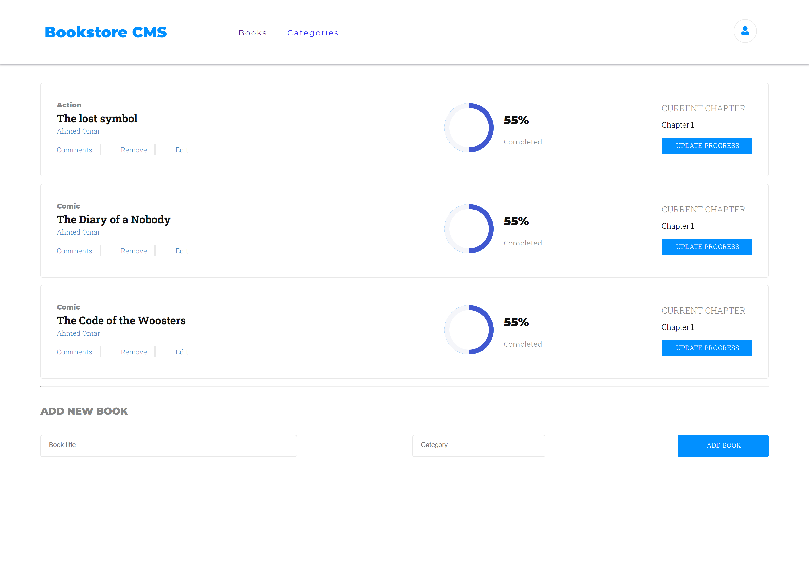

# Bookstore

> Book Store is a website that allows you to make you book list by adding, removing books.

## Built With

- JS & ECMA 6
- React JS, JSX
- Redux, Styled-components

## Getting Started
> To get a local copy up and running follow these simple example steps.
- git clone https://github.com/ahmed-al-farouq/Book-Store.git
- cd BookStore
- npm install  # install dependencies
> and then to start a live server run
- npm run start

> to build a production version to `bulid` folder run
- npm run build

## Authors
:bearded_person: **Ahmed Al-Farouq**
  - Github: [@Ahmed-Alfarouq](https://github.com/ahmed-al-farouq)
  - LinkedIn: [LinkedIn](https://www.linkedin.com/in/ahmed-al-farouq/)
  - Twitter: [@twitter](https://twitter.com/ahmed_al_farouq)

## 🤝 Contributing

Contributions, issues, and feature requests are welcome!

Feel free to check the [issues page](../../issues/).

## Show your support

Give a ⭐️ if you like this project!
